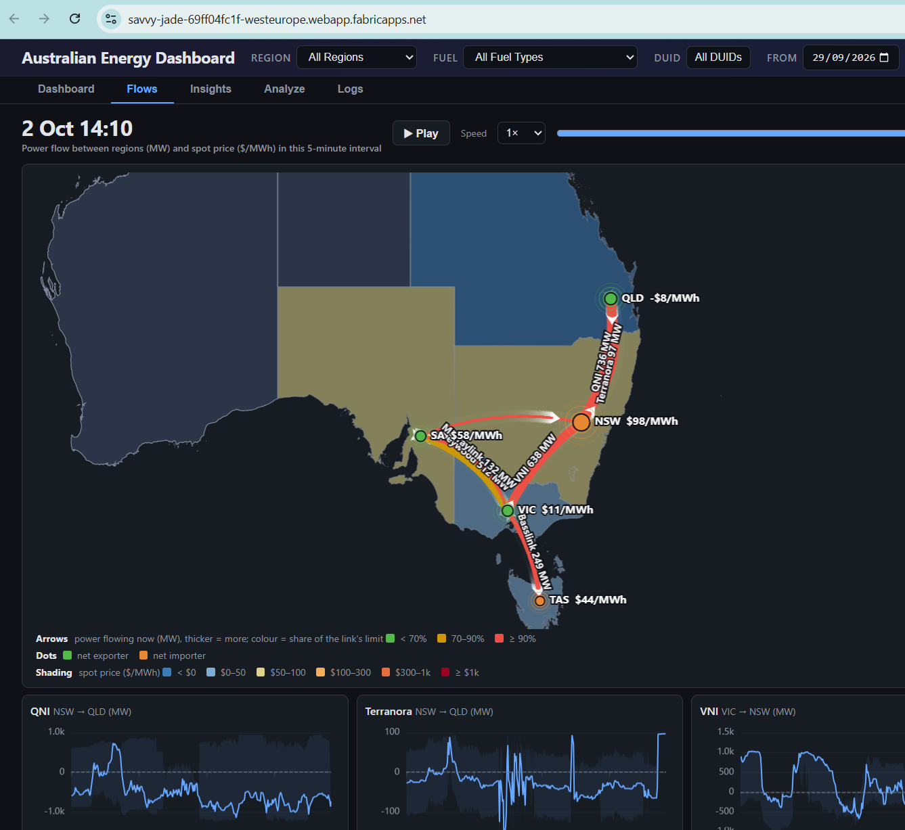
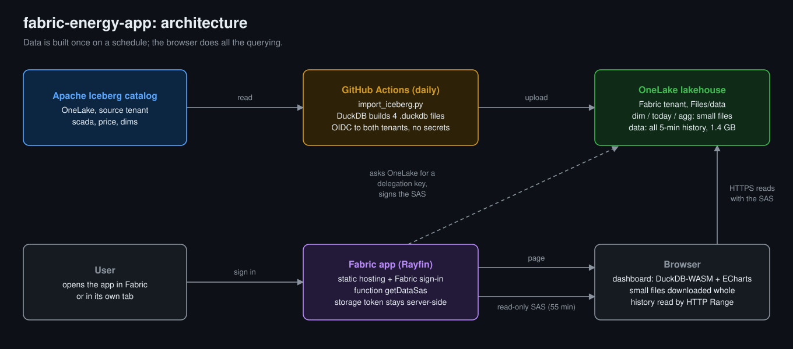

# fabric-energy-app

An Australian energy market dashboard, built as a **Microsoft Fabric** app with
[Rayfin](https://www.npmjs.com/package/@microsoft/rayfin-cli). Fabric hosts the page and signs you
in, and the page reads its data **directly from OneLake** — no backend to run, no query service.



It is the same dashboard as [NemTracker](https://nemtracker.github.io/), hosted on Fabric.

## How it works



- **Hosting:** `rayfin up` deploys the `site/` folder to Fabric static hosting.
- **Sign-in:** Fabric single sign-on. Inside the Fabric portal there is no extra login; in its own
  tab it is one click.
- **Data:** the dashboard's files live in a lakehouse, under `Files/data`. The browser reads them
  from OneLake itself, with read-only access to that one folder.
- **Refresh:** a GitHub workflow (`.github/workflows/import_data.yml`) rebuilds those files from
  the source catalog and uploads them to the lakehouse.

## Limitations

This is an experiment. Read these before you copy it:

- **Security is per table, not per row.** Only people the app is shared with in Fabric can sign in
  and read the data. For them, there is no row-level or
  column-level security (RLS / CLS). If different users must see different rows or columns, use
  something else.
- **No public access.** Every visitor has to sign in with a Fabric account the app is shared with.
  As far as I can tell, it cannot be opened anonymously.
- **Single-threaded.** The query engine runs in the browser (WebAssembly) on one thread: a heavy
  query blocks until it finishes, and more cores do not help. This may change in the future.
- **Limited by the browser.** A tab gets about 4 GB of memory; a query that needs more fails. Phones
  and old laptops will struggle.

## Setup

You need a Fabric workspace with a lakehouse:

- Workspace settings → OneLake → turn on **Authenticate with OneLake user-delegated SAS tokens** (off by
  default; the tenant setting *Use short-lived user-delegated SAS tokens* is on by default).
- The owner of the Fabric app item must be able to read the lakehouse.
- After the first `rayfin up`, store the lakehouse Files URL as a Rayfin secret:
  `echo https://onelake.dfs.fabric.microsoft.com/<ws>/<lh>.Lakehouse/Files | npx rayfin secret set ONELAKE_FILES_URL --stdin`

Everything else is Rayfin — see the [Rayfin documentation](https://learn.microsoft.com/fabric/embedded/rayfin/overview) for full details:

```bash
rayfin login      # sign in to Fabric
rayfin up         # build + deploy to Fabric static hosting; prints the hosting URL
```

Then run the **Import Data** workflow to fill the lakehouse, and open the app inside the Fabric
portal or in its own tab.
